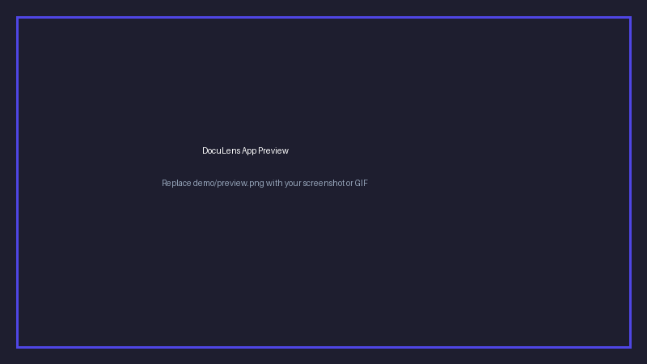

# 📑 DocuLens — Grounded RAG PDF Assistant

[](https://your-app-url.streamlit.app/)
[](LICENSE)
[](https://www.python.org/downloads/)

> A production-ready, hallucination-resistant Retrieval-Augmented Generation (RAG) tool designed to query dense technical PDF documents and return strictly grounded answers with page-level citations.

---

## 🚀 Live Demo & Visuals

- **Live App:** https://doculens-rag-assistant-c7cp47yxbj6deykx5uc5ww.streamlit.app/
- **Demo GIF / Screenshot:** Add your recorded GIF or screenshot into `demo/preview.png`.



---

## ✨ Key Features

- **Strict Source Grounding:** Constrained prompt template ensures the model avoids external hallucinations and admits when the document lacks relevant details.
- **Page-Level Citations:** Automatically returns verified source page numbers with each response.
- **Optimized Recursive Chunking:** Custom splitting parameters (`chunk_size=800`, `chunk_overlap=120`) preserve semantic boundaries and multi-paragraph flow.
- **Lightweight Vector Store:** Uses ChromaDB with in-memory persistence for fast retrieval without external vector database dependencies.
- **Interactive UI:** Clean, responsive chat interface built with Streamlit's native chat components.

---


## ⚡ Local Setup Instructions

### 1. Clone the repository
```bash
git clone https://github.com/your-username/doculens.git
cd doculens
```

### 2. Set up virtual environment
```bash
python -m venv venv
# On Linux / macOS:
source venv/bin/activate
# On Windows:
venv\Scripts\activate
```

### 3. Install dependencies
```bash
pip install -r requirements.txt
```

### 4. Configure environment variables
```bash
cp .env.example .env
```
Open `.env` and add your OpenAI API key:
```env
OPENAI_API_KEY=sk-...
```

### 5. Launch the application
```bash
streamlit run app.py
```

---

## 🌐 Deploy to Streamlit Cloud (Free & Easy)

1. Push your repository to GitHub.
2. Visit [share.streamlit.io](https://share.streamlit.io/) and log in with your GitHub account.
3. Click **"New App"** and choose your repository, branch (`main`), and set the main file path to `app.py`.
4. Under **Advanced Settings > Secrets**, add:
   ```toml
   OPENAI_API_KEY = "your-actual-api-key"
   ```
5. Click **Deploy**. Your app is live!

---

## 🧠 What I Learned & Key Takeaways

1. **Chunk Boundaries Matter:** Plain character chunking often truncates sentences midway. Using `RecursiveCharacterTextSplitter` with tuned overlaps maintained context coherence across dense clauses.
2. **Cost-to-Performance Efficiency:** Leveraging `text-embedding-3-small` achieved high retrieval precision while reducing token costs significantly compared to legacy embedding models.
3. **User Trust Through Citations:** LLMs alone fail user trust without attribution. Embedding document metadata directly into the retrieval-to-generation pipeline enables instant human verification.

---

## 📄 License
This project is distributed under the [MIT License](LICENSE).
